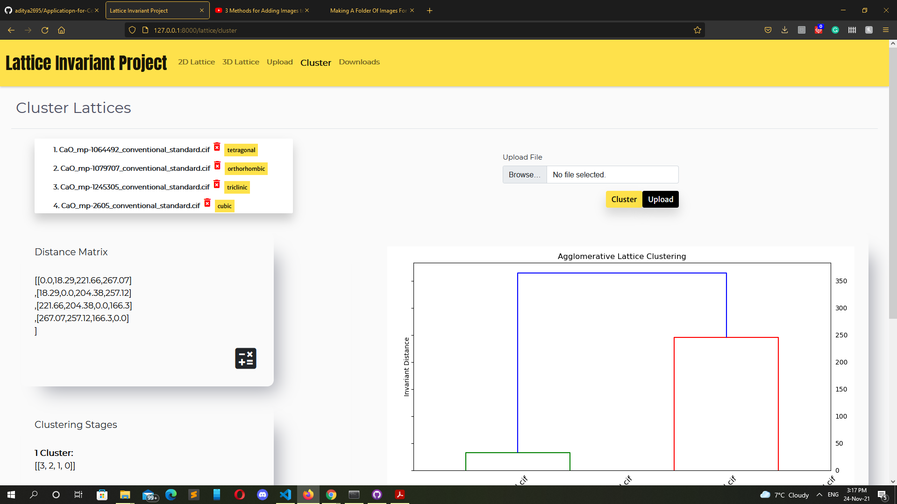

# Application for Computation of Lattice Invariants

## Problem

This project aims to develop a web application that can be used to compare 2-dimensional or 3-dimensional lattices by providing lattice parameters as a set of cell lengths and angles thereby providing a platform to calculate the isometry invariants and visualize the similarity distance between lattices. 

Moreover, this project also aims to provide an interface to upload crystallographic datasets like CIF files and compare the uploaded files and visualize the invariant distance. The application allows users to upload data files and perform hierarchical clustering between the lattices from the uploaded files. The resulting clustering output was visualized graphically in the form of a dendrogram. This dendrogram can be used to assess the similarity between lattices. 

## DataSet
In this project, we have used Crystallographic data from CCDC database and Materials project website. 

This data is in the form of CIF files.Also, manual data entry have been used.

## Setup
This part includes the the basic setup used to run the application.

Libraries used in the application are:
•	NumPy\
•	Matplotlib\
•	SciPy\
•	Gemmi \
•	Pymatgen

<ul>
        <li > 1.Django installation
        <li>   pip install Django
        <li>2.	NumPy installation 
        <li>    pip install numpy
        <li>3.	SciPy installation
        <li>    pip install scipy
        <li>4.	Gemmi installation
        <li>    pip install gemmi
        <li>5.	Pymatgen installation
        <li>	    pip install pymatgen
        <li>6. Matplotlib installation
        <li>    pip install matplotlib
</ul>

## Testing

1. Extract the zip folder 
2. To run the application, go to the base directory containing the file ‘manage.py’ 
3. Execute python manage.py runserver.
4. The application runs by default on port 8000.
5. The URL http://127.0.0.1:8000/lattice/home takes you to the   application home screen.

 Figure 2: Various Lattice types of CaO clustered heirarchically  

 Figure 3: Various Lattice types of CaO clustered heirarchically  

 Figure 3: Scatter plot of the Distance comparison of the different MgO crystal systems 

 Figure 3: Scatter plot of the Distance comparison of the different CaO crystal systems 

## References

1. IUCr, “Crystallographic Information Framework,” [Online]. Available: https://www.iucr.org/resources/cif. [Accessed September 2021].
“Wikipedia: Crystal_system,” [Online]. Available: https://en.wikipedia.org/wiki/Crystal_system. [Accessed August 2021].
2. J. H. Conway and N. J. A. Sloane, “Low-Dimensional Lattices. VI. Voronoi Reduction of Three-Dimensional Lattices.,” Proceedings: Mathematical and Physical Sciences, vol. 436(1896), p. 55–68, 1992. 
3. S. P. Ong, D. W. Richards, A. Jain, G. Hautier, M. Kocher, S. Cholia, D. Gunter, V. Chevrier, K. A. Persson and G. Ceder, “Python Materials Genomics (pymatgen) : A Robust, Open-Source Python Library for Materials Analysis,” Computational Materials Science, vol. 68, p. 314–319, 2013. 
A. Jain, . S. P. Ong, . G. Hautier, . W. Chen, . W. D. Richards, . S. Dacek, . S. Cholia, D. Gunter, . D. Skinner, . G. Ceder and . K. A. Persson, “Commentary: 
4. The Materials Project: A materials genome approach to accelerating materials innovation,” APL Materials, vol. 1, no. 1, p. 011002, 2013. 
5. M. Bright, A. I. C. and V. Kurlin, “Easily computable continuous metrics on the space of isometry classes of all 2-dimensional lattices,” arXiv, vol. 2109.10885, 2021. 
6. “GEMMI - library for structural biology,” 2021. [Online]. Available: https://gemmi.readthedocs.io/en/latest/#. [Accessed October 2021].
7. C. R. Groom, . I. J. Bruno, . M. P. Lightfoot and . S. C. Ward, “The Cambridge Structural Database,” Acta Crystallographica Section B, vol. 72, pp. 171-179, 2016. 
8. A. H. Larsen, J. J. Mortensen, J. Blomqvist, E. C. Ivano , R. Christensen, J. Friis, M. N. Groves, B. Hammer, C. Hargus and E. D. Hermes, “The atomic simulation environment a Python library for working with atoms,” Journal of Physics: Condensed matter, vol. 29, no. 27, p. 273002, June 2017. 
9. “Crystal Lattices and Unit Cells,” [Online]. Available: https://www.open.edu/openlearn/science-maths-technology/minerals-and-the-crystalline-state/content-section-6.2.

